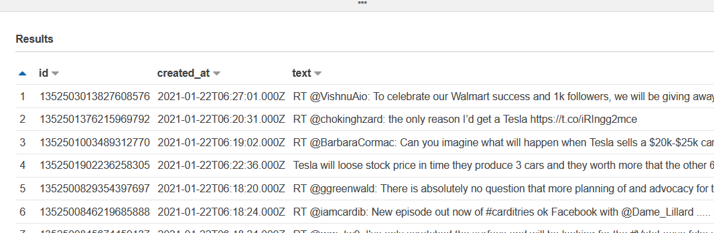

# Company Tweets into Kafka Streaming Project
Goal of this project is to play with Spark, AWS EMR, Spark Streaming data, Terraform, Ansible

## Business Use Case

The business use case can be for an investment firm. They may wants to understand the public's opinion about certain companies to see if there's as correlation between this and future stock prices. Unfortunately live stock price API is very costly so this will not be incorporated in this project. I may add an extra pipeline that gets the daily stock prices and puts them in S3

## Architecture

1. Create connection with [Twitter's Filter Stream API](https://developer.twitter.com/en/docs/twitter-api/tweets/filtered-stream/introduction). Use a producer written with Java which connects to the API and sends these tweets to a topic in Kafka. This is in folder `./twitterProducer`
3. A pySpark Structured Streaming Kafka Consumer will consume tweets in from Kafka, convert the tweets to JSON format the tweets are in into structured data for databases. See `./twitterConsumer`
4. Consumer will save tweets in Parquet format in an AWS S3 Bucket for future use
    

### Design Choices
I chose to manage my own kafka cluster, and AWS EMR with spark structured streams to just get a chance to play around with these tecnologies. Ansible was helpful with installing Kafka on all the hosts programatically, restarting kafka cluster. Both terraform and ansible were helpful for documenting steps programatically for transparency, reproducibility.

In a production environment, depending on how important this data is and what goals the team has, it may make more sense to *not* use self-managed kafka cluster, extra producer running manually/ec2 instance and even spark structured streaming. It's hard to maintain, and the large ec2 instances involved are costly per hour. I would probably choose just AWS Kinesis for this simple, low-streaming-rate application, with only one consumer. I would probably use lambda for processing the data. If I was using an CPU intensive ML model to classify the tweets, or needed more throughput, maybe an occasional batch processing job using EMR would be better.

Other design choices: I used both java and python since I wanted to work with both. But it may make more sense to stick to 1 language in a production environment.

## Set up:
Pre-set up:
* Twitter API:
    1. [Get approval](https://developer.twitter.com/en/apply-for-access) for setting up a Twitter API account
    2. Create API Keys as [per instructions here](https://developer.twitter.com/en/docs/twitter-api/tweets/filtered-stream/quick-start)
* Install Terraform, Ansible
* If you are running the Producer from your computer, install Java. If not, then you could save the producer as a .jar file and then run it as a daemon process on a server.
* Make sure `terraform/variables.tf` and `ansible/hosts.yml`uses the profile that you have the private key for. This will be the key pair you would use in 

**This guide is a work in progress**

### 1. Set up Kafka Cluster 
1. Set up Terraform: Go to ./terraform
2. Run `terraform plan` to ensure that there are no issues with the terraform plan
3. Run `terraform apply` to create aws resources
4. Go to ./ansible: `cd ../ansible/.`
5. Update `./updateServers.sh` with newly created servers, and run the file: `./updateServers.sh`
6. To install Kafka, and start Zookeeper and brokers: `ansible-playbook -i hosts.yml kafka.yml`
7. See readme to create kafka topic in a broker
### 3. Run Twitter Producer
Add `BEARER_TOKEN` as environmental variable to system. One may initially run unit tests in `./twitterProducer/src/tests/.` to ensure that it's working
1. Currently I run java project from IDE, though at some point may package it as a jar as a daemon process
In `FilteredStreamDemo.java`, make sure to replace `bootstrapServers` with the server and port of one of the kafka cluster's brokers
### 4. Run Twitter Consumer on AWS EMR
1. In consumer.py, replace variable `BOOTSTRAP_SERVERS` with the list of the kafka brokers in the kafka cluster being used. Upload this consumer to a bucket in S3. Also can replace where spark structured streaming checkpoints  and actual output parquet data will be saved
2. Submit the spark application to the AWS EMR cluster created with terraform. Look at `./twitterConsumer/readme.md` for AWS CLI command. 

Once the data starts coming into the Athena Folder, you can 

## Possible Future Improvements
* Continous Data quality checks on
	* data that comes out of twitter api before it's sent to Kafka with TwitterProducer
	* data from kafka in spark streaming, before it's saved as a parquet (tradeoff is that more latency)
* Connect EC2 Instances to domain name - so that when I have to stutdown/restart Kafka, I don't have to change the ansible kafka installer, pyspark consumer, and java producer inputs
* Are there tests I can add to the consumer? At least integration tests
* Save Producer as a .jar file, and add parameters to allow one to submit kafka broker to send data to. run as a daemon process on an EC2 Instance
* If EMR Cluster, and Kafka is still running, is there a way to automate starting from missed offsets? 
* Adjust NLP script to classify tweets using [John Snow Lab's NLP Library](https://nlp.johnsnowlabs.com/)