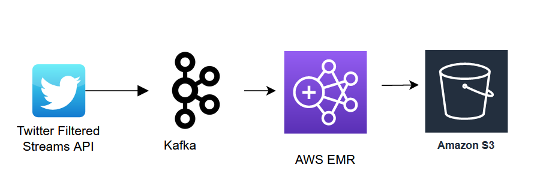

# Company Tweets into Kafka Streaming Project
Goal of this project is to play with Spark, AWS EMR, Spark Streaming data, Terraform, Ansible

## Business Use Case

The business use case can be for an investment firm. They may wants to understand the public's opinion about certain companies to see if there's as correlation between this and future stock prices. Unfortunately live stock price API is very costly so this will not be incorporated in this project. I may add an extra pipeline that gets the daily stock prices and puts them in S3

## Architecture

1. Create connection with [Twitter's Filter Stream API](https://developer.twitter.com/en/docs/twitter-api/tweets/filtered-stream/introduction). Use a producer written with Java which connects to the API and sends these tweets to a topic in Kafka. This is in folder `./twitterProducer`
3. A pySpark Structured Streaming Kafka Consumer will consume tweets in from Kafka, convert the tweets to JSON format the tweets are in into structured data for databases. See `./twitterConsumer`
4. Consumer will save tweets in Parquet format in an AWS S3 Bucket for future use
    

### Design Choices
I chose to use **Kafka** in order to get experience with setting up my own Kafka cluster! **Ansible** was helpful with installing Kafka on all the hosts programatically, restarting kafka cluster, as well as documenting steps programatically for transparency, reproducibility.

In a production environment, it may make more sense to *not* use self-managed kafka cluster. I would probably choose AWS Kinesis for this simple, low-streaming-rate application. 

To fully flesh out reasoning, the alternatives could be:
* Send tweets straight to simple socket ([example](https://towardsdatascience.com/sentiment-analysis-on-streaming-twitter-data-using-spark-structured-streaming-python-fc873684bfe3)) and then send data in socket to Spark Structured Streaming application in AWS EMR. This makes sense if the AWS EMR application is the only 'consumer' of the tweet data involved in this project, and the rate of data being streamed is constant and predictable (Kafka seems easier to scale), and it's fine for the application to go down and miss capturing some streams 
* Use a managed service like AWS MSK or Kinesis. This makes sense if multiple consumers need to access data, I'm on a project with limited time and $ resources to maintain a kafka cluster. Whether AWS MSK or Kinesis is better depends on multiple factors including costs, importance of data (whether data can be missed and replicated data is necessary), and throughput required for job. 

Other design choices:
* AWS EMR:
    * **Easy** to set up, and doesn't require much maintanence work
    * **Cost**: I am paying for the maintanence of the cluster
    * Spark Structured Streaming:
        * One can **Track Offets being read from Kafka** which is useful in case the application goes offline, and it needs to be restarted 
        * The amount of data gathered and saved to a parquet part in S3 in the next step can be adjusted by the `df.writeStream().trigger()` setting. Another spark application would have an easier time with reading large parquet files vs multiple small ones, where the trigger is a large number of minutes. A shorter trigger may be better if the data needed to be immediately used for something downstream
        * You can apply transformations and Spark ML Models on streamed data. If I wasn't saving the streamed data in S3, and using Postgres, I could consider using a tool like 
* **S3**
    * Has event notifications which can alert Snowflake, or another service that there is new data to ingest
    * I can also easily query the data in s3 with AWS Athena
* **Terraform**: Very easy to set up and takedown AWS Resources. Also useful to easily document resources used
* **Java vs Python**: May make more sense to stick to one language in a production environment. But I wanted to play around with Java OOP

## Set up:
Pre-set up:
* Twitter API:
    1. [Get approval](https://developer.twitter.com/en/apply-for-access) for setting up a Twitter API account
    2. Create API Keys as [per instructions here](https://developer.twitter.com/en/docs/twitter-api/tweets/filtered-stream/quick-start)
* Install Terraform, Ansible
* If you are running the Producer from your computer, install Java. If not, then you could save the producer as a .jar file and then run it as a daemon process on a server.
* Make sure `terraform/variables.tf` and `ansible/hosts.yml`uses the profile that you have the private key for. This will be the key pair you would use in 

### 1. Set up Kafka Cluster 
1. Set up Terraform: Go to ./terraform. Ensure that 
2. Run `terraform plan` to ensure that there are no issues with the terraform plan
3. Run `terraform apply` to create aws resources
### 2. Run Twitter Producer

### 3. Run Twitter Consumer on AWS EMR

## Future Improvements:
* Adjust NLP script to classify tweets using [John Snow Lab's NLP Library](https://nlp.johnsnowlabs.com/)
* Save Producer as a .jar file, run as a daemon process on an EC2 Instance
* Create unit tests for TwitterProducer - look into Mock Producer or Kafka on docker to avoid creating cluster for testing
* In Spark Structured Streaming script - add offset value to column in order to track offsets in case job breaks (bonus: way to automatically restart job from point of last offset?)
* Send data to dashboard, or to database using S3 event notifications
* What would happen if AWS went down (such as when AWS east went down recently)